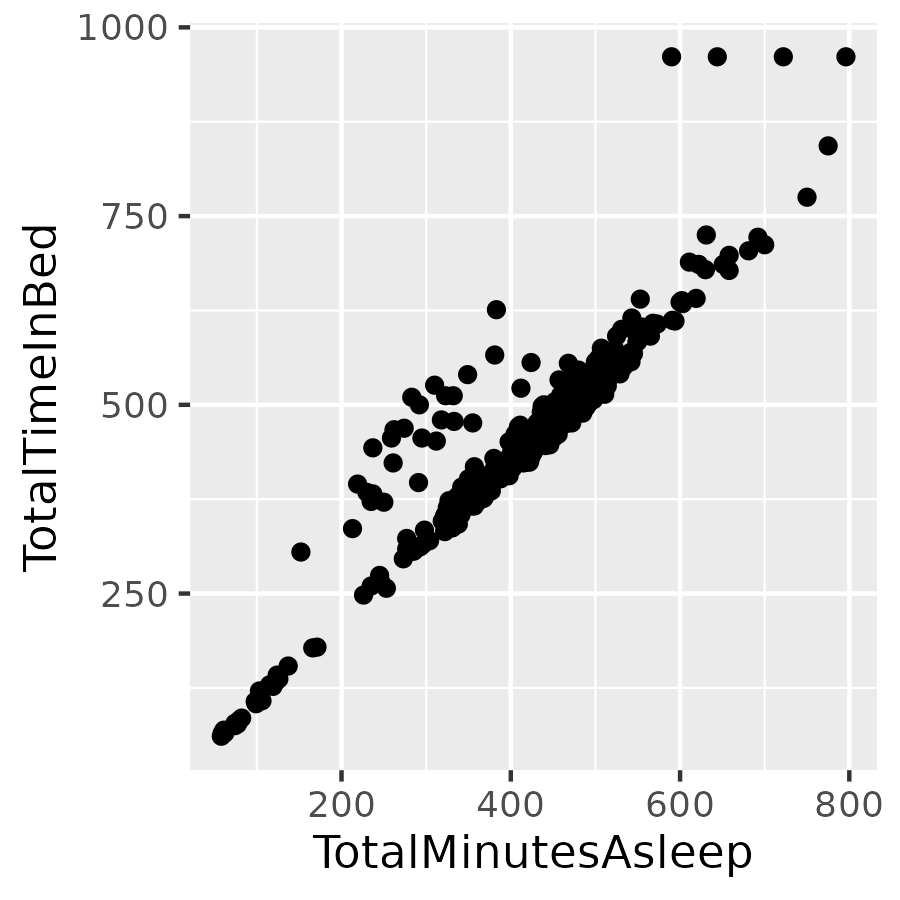

# Bellabeat-Capstone
## Business Task:
Analyze how users are using non-Bellabeat smart devices to gain insights and using these insights to make data-driven decisions relating to Bellasbeat products. 

## Stakeholders:

Urška Sršen: Bellabeat’s cofounder and Chief Creative Officer

Sando Mur: Mathematician and Bellabeat’s cofounder; key member of the Bellabeat executive team.

Bellabeat marketing analytics team

## Data Source:
The datasource being used is FitBit Fitness Tracker Data, a public domain data made available through Mobious. Thirty eligible Fitbit users consented to the submission of personal tracker data, including minute-level output for physical activity, heart rate, and sleep monitoring. It includes information about daily activity, steps, and heart rate that can be used to explore users’ habits.

## Cleaning and manipulation of data:
I used Google sheets to manipluate the date columns in daily_sleep and daily_activity to read "Date" to merge the two datasets together. The rest of the data manipulation was done in the programming language R.

### Step 1: Loading packages

```R
install.packages("tidyverse")
library(tidyverse)
library(readr)
```
### Step 2: Importing data
```R
daily_sleep<- read_csv("daily_sleep - sleepDay_merged.csv")
daily_activity<- read_csv("daily_activity - dailyActivity_merged.csv")
```
### Step 3: Data overview
3.1 Viewing first few rows of each dataset:
```R
head(daily_sleep)
# A tibble: 6 × 5
          Id Date      TotalSleepRecords TotalMinutesAsleep
       <dbl> <chr>                 <dbl>              <dbl>
1 1503960366 4/12/2016                 1                327
2 1503960366 4/13/2016                 2                384
3 1503960366 4/15/2016                 1                412
4 1503960366 4/16/2016                 2                340
5 1503960366 4/17/2016                 1                700
6 1503960366 4/19/2016                 1                304
# ℹ 1 more variable: TotalTimeInBed <dbl>
```
```R
head(daily_activity)
# A tibble: 6 × 15
          Id Date   TotalSteps TotalDistance TrackerDistance
       <dbl> <chr>       <dbl>         <dbl>           <dbl>
1 1503960366 4/12/…      13162          8.5             8.5 
2 1503960366 4/13/…      10735          6.97            6.97
3 1503960366 4/14/…      10460          6.74            6.74
4 1503960366 4/15/…       9762          6.28            6.28
5 1503960366 4/16/…      12669          8.16            8.16
6 1503960366 4/17/…       9705          6.48            6.48
# ℹ 10 more variables: LoggedActivitiesDistance <dbl>,
#   VeryActiveDistance <dbl>,
#   ModeratelyActiveDistance <dbl>,
#   LightActiveDistance <dbl>,
#   SedentaryActiveDistance <dbl>, VeryActiveMinutes <dbl>,
#   FairlyActiveMinutes <dbl>, LightlyActiveMinutes <dbl>,
#   SedentaryMinutes <dbl>, Calories <dbl>
```
3.2 Viewing column names for each dataset:
```R
colnames(daily_activity)
 [1] "Id"                       "Date"                    
 [3] "TotalSteps"               "TotalDistance"           
 [5] "TrackerDistance"          "LoggedActivitiesDistance"
 [7] "VeryActiveDistance"       "ModeratelyActiveDistance"
 [9] "LightActiveDistance"      "SedentaryActiveDistance" 
[11] "VeryActiveMinutes"        "FairlyActiveMinutes"     
[13] "LightlyActiveMinutes"     "SedentaryMinutes"        
[15] "Calories"                
```
```R
> colnames(daily_sleep)
[1] "Id"                 "Date"              
[3] "TotalSleepRecords"  "TotalMinutesAsleep"
[5] "TotalTimeInBed"    
```
3.3 Viewing number of distinct ID values for each dataset:
```R
n_distinct(daily_activity$Id)
[1] 33
n_distinct(daily_sleep$Id)
[1] 24
```
There are 33 distinct Id values for daily_activity and 24 values for daily_sleep meaning some users tracked their activity more than they tracked their sleep or there is a discrepency between the two datasets.

3.4 Viewing number of rows in each dataset:
```R
nrow(daily_activity)
[1] 940
nrow(daily_sleep)
[1] 413
```
### Step 4: Data cleaning and manipulation

4.1 Checking for duplicate rows:

```R
sum(duplicated(daily_activity))
[1] 0
sum(duplicated(daily_sleep))
[1] 3
```
4.2 Removing duplicate rows:

```R
daily_sleep<-daily_sleep[!duplicated(daily_sleep),]
```

4.3 Checking for rows with no data tracked

```R
daily_sleep %>% filter(TotalTimeInBed ==0)
# A tibble: 0 × 5
# ℹ 5 variables: Id <dbl>, Date <chr>,
#   TotalSleepRecords <dbl>, TotalMinutesAsleep <dbl>,
#   TotalTimeInBed <dbl>
```

```R
daily_activity %>% filter(TotalSteps ==0)
# A tibble: 77 × 15
           Id Date  TotalSteps TotalDistance TrackerDistance
        <dbl> <chr>      <dbl>         <dbl>           <dbl>
 1 1503960366 5/12…          0             0               0
 2 1844505072 4/24…          0             0               0
 3 1844505072 4/25…          0             0               0
 4 1844505072 4/26…          0             0               0
 5 1844505072 5/2/…          0             0               0
 6 1844505072 5/7/…          0             0               0
 7 1844505072 5/8/…          0             0               0
 8 1844505072 5/9/…          0             0               0
 9 1844505072 5/10…          0             0               0
10 1844505072 5/11…          0             0               0
# ℹ 67 more rows
# ℹ 10 more variables: LoggedActivitiesDistance <dbl>,
#   VeryActiveDistance <dbl>,
#   ModeratelyActiveDistance <dbl>,
#   LightActiveDistance <dbl>,
#   SedentaryActiveDistance <dbl>, VeryActiveMinutes <dbl>,
#   FairlyActiveMinutes <dbl>, …
# ℹ Use `print(n = ...)` to see more rows
```

4.4 Removing rows with no data tracked:

```R
daily_activity<-daily_activity %>% filter(TotalSteps !=0)
daily_activity %>% filter(TotalSteps ==0)
# A tibble: 0 × 15
# ℹ 15 variables: Id <dbl>, Date <chr>, TotalSteps <dbl>,
#   TotalDistance <dbl>, TrackerDistance <dbl>,
#   LoggedActivitiesDistance <dbl>,
#   VeryActiveDistance <dbl>,
#   ModeratelyActiveDistance <dbl>,
#   LightActiveDistance <dbl>,
#   SedentaryActiveDistance <dbl>, …
```
4.5 Merging daily_activity and daily_sleep

 ```R
combined_data<-merge(daily_sleep,daily_activity,by=c("Id","Date"),all = TRUE)
 ```
4.6 Adding a weekday column to combined_data dateframe
```R
combined_data <- combined_data %>% 
  mutate( Weekday = weekdays(as.Date(Date, format = "%m/%d/%Y")))
```
4.7 Adding levels to weekday column for better visualization:
```R
combined_data$Weekday <- factor( combined_data$Weekday, levels = c("Monday", "Tuesday", "Wednesday", "Thursday", "Friday", "Saturday", "Sunday"))
```

### Step 5: Analysis

5.1 Data summary:
```R
daily_sleep %>% 
   select(TotalTimeInBed,
          TotalSleepRecords,
          TotalMinutesAsleep) %>% 
   summary()
 TotalTimeInBed  TotalSleepRecords TotalMinutesAsleep
 Min.   : 61.0   Min.   :1.00      Min.   : 58.0     
 1st Qu.:403.8   1st Qu.:1.00      1st Qu.:361.0     
 Median :463.0   Median :1.00      Median :432.5     
 Mean   :458.5   Mean   :1.12      Mean   :419.2     
 3rd Qu.:526.0   3rd Qu.:1.00      3rd Qu.:490.0     
 Max.   :961.0   Max.   :3.00      Max.   :796.0
```
On average, users are sleeping for around seven hours a night and spening just over seven and a half hours in bed. There is a strong corrilation between minutes in bed and minutes asleep:
<!--
Source - https://stackoverflow.com/a/26138535
Posted by alciregi, modified by community. See post 'Timeline' for change history
Retrieved 2025-11-13, License - CC BY-SA 4.0
-->



